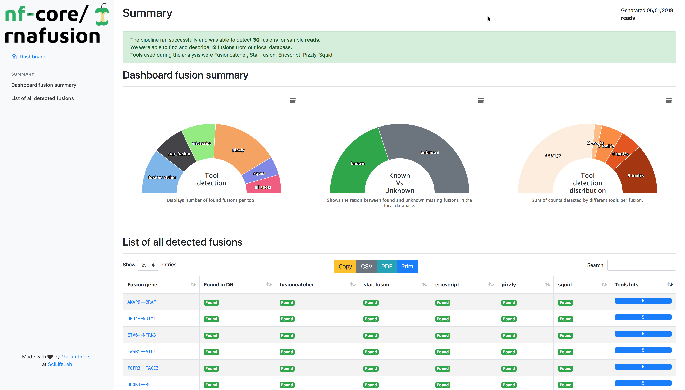

# 

[](https://travis-ci.org/nf-core/rnafusion)
[](https://www.nextflow.io/)
[](https://github.com/nf-core/rnafusion/blob/master/LICENSE)

[](http://bioconda.github.io/)
[](https://hub.docker.com/r/nfcore/rnafusion)


**nfcore/rnafusion** uses RNA-seq data to detect fusions genes.

The workflow processes RNA-sequencing data from FastQ files. It runs quality control on the raw data ([FastQC](https://www.bioinformatics.babraham.ac.uk/projects/fastqc/)), detects fusion genes ([STAR-Fusion](https://github.com/STAR-Fusion/STAR-Fusion), [Fusioncatcher](https://github.com/ndaniel/fusioncatcher), [Ericscript](https://sites.google.com/site/bioericscript/), [Pizzly](https://github.com/pmelsted/pizzly), [Squid](https://github.com/Kingsford-Group/squid)), gathers information ([FusionGDB](https://ccsm.uth.edu/FusionGDB/index.html)), visualizes the fusions ([FusionInspector](https://github.com/FusionInspector/FusionInspector)), performs quality-control on the results ([MultiQC](http://multiqc.info)) and finally generates custom summary report.



The pipeline works with both single-end and paired-end data, though not all fusion detection tools work with single-end data (Ericscript, Pizzly, Squid and FusionInspector).

The pipeline is built using [Nextflow](https://www.nextflow.io), a workflow tool to run tasks across multiple compute infrastructures in a very portable manner. It comes with docker / singularity containers making installation trivial and results highly reproducible.

| Tool            | Single-end reads | CPU (recommended) | RAM (recommended) |
| --------------- |:----------------:|:-----------------:|:-----------------:|
| [Star-Fusion](https://github.com/STAR-Fusion/STAR-Fusion/wiki) | Yes              | >=16 cores        | ~30GB             |
| [Fusioncatcher](https://github.com/ndaniel/fusioncatcher/blob/master/doc/manual.md) | Yes              | >=16 cores        | ~60GB             |
| [Ericscript](https://sites.google.com/site/bioericscript/getting-started) | **No**           | >=16 cores        | ~30GB             |
| [Pizzly](https://github.com/pmelsted/pizzly) | **No**           | >=16 cores        | ~30GB             |
| [Squid](https://github.com/Kingsford-Group/squid) | **No**           | >=16 cores        | ~30GB             |
| [FusionInspector](https://github.com/FusionInspector/FusionInspector/wiki) | **No**           | >=16 cores        | ~30GB             |

> **TL;DR:** Make sure to download all required references for each tool. More details can be found in section [tools](docs/tools.md).

```bash
nextflow run nf-core/rnafusion --reads '*_R{1,2}.fastq.gz' --genome GRCh38 -profile docker --star_fusion --fusioncatcher --ericscript --pizzly --squid --fusion_inspector
```

For available parameters or help run:

```bash
nextflow run nf-core/rnafusion --help
```

## Documentation

The nf-core/rnafusion pipeline comes with documentation about the pipeline, found in the `docs/` directory:

1. [Installation](docs/installation.md)
2. Pipeline configuration
    * [Download references for tools](docs/references.md)
    * [Local installation](docs/configuration/local.md)
    * [Adding your own system](docs/configuration/adding_your_own.md)
3. [Running the pipeline](docs/usage.md)
4. [Output and how to interpret the results](docs/output.md)
5. [Troubleshooting](docs/troubleshooting.md)

Use predefined configuration for desired Institution cluster provided at [nfcore/config](https://github.com/nf-core/configs) repository.
