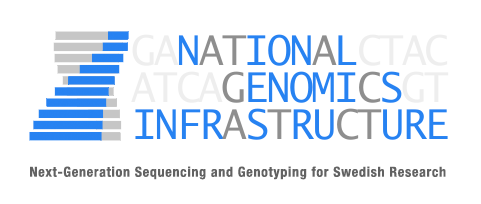

# 

[](https://travis-ci.org/nf-core/rnafusion)
[](https://www.nextflow.io/)
[](https://zenodo.org/badge/latestdoi/151721952)
[](https://nf-core-invite.herokuapp.com)
[](https://github.com/nf-core/rnafusion/blob/master/LICENSE)

[](http://bioconda.github.io/)
[](https://hub.docker.com/r/nfcore/rnafusion)


**nfcore/rnafusion** uses RNA-seq data to detect fusions genes.

The workflow processes RNA-sequencing data from FastQ files. It runs quality control on the raw data ([FastQC](https://www.bioinformatics.babraham.ac.uk/projects/fastqc/)), detects fusion genes ([STAR-Fusion](https://github.com/STAR-Fusion/STAR-Fusion), [Fusioncatcher](https://github.com/ndaniel/fusioncatcher), [Ericscript](https://sites.google.com/site/bioericscript/), [Pizzly](https://github.com/pmelsted/pizzly), [Squid](https://github.com/Kingsford-Group/squid)), gathers information ([FusionGDB](https://ccsm.uth.edu/FusionGDB/index.html)), visualizes the fusions ([FusionInspector](https://github.com/FusionInspector/FusionInspector)), performs quality-control on the results ([MultiQC](http://multiqc.info)) and finally generates custom summary report. 

> Check out this live **demo [here](https://matq007.github.io/fusion-report/example/)**.

The pipeline works with both single-end and paired-end data, though not all fusion detection tools work with single-end data (Ericscript, Pizzly, Squid and FusionInspector).

The pipeline is built using [Nextflow](https://www.nextflow.io), a workflow tool to run tasks across multiple compute infrastructures in a very portable manner. It comes with docker / singularity containers making installation trivial and results highly reproducible.

| Tool            | Single-end reads | CPU (recommended) | RAM (recommended) |
| --------------- |:----------------:|:-----------------:|:-----------------:|
| [Star-Fusion](https://github.com/STAR-Fusion/STAR-Fusion/wiki) | Yes              | >=16 cores        | ~30GB             |
| [Fusioncatcher](https://github.com/ndaniel/fusioncatcher/blob/master/doc/manual.md) | Yes              | >=16 cores        | ~60GB             |
| [Ericscript](https://sites.google.com/site/bioericscript/getting-started) | **No**           | >=16 cores        | ~30GB             |
| [Pizzly](https://github.com/pmelsted/pizzly) | **No**           | >=16 cores        | ~30GB             |
| [Squid](https://github.com/Kingsford-Group/squid) | **No**           | >=16 cores        | ~30GB             |
| [FusionInspector](https://github.com/FusionInspector/FusionInspector/wiki) | **No**           | >=16 cores        | ~30GB             |

For available parameters or help run:

```bash
nextflow run nf-core/rnafusion --help
```

## Documentation

The nf-core/rnafusion pipeline comes with documentation about the pipeline, found in the `docs/` directory:

1. [Installation](docs/installation.md)
2. Pipeline configuration
    * [Download references for tools](docs/references.md)
    * [Local installation](docs/configuration/local.md)
    * [Adding your own system](docs/configuration/adding_your_own.md)
3. [Running the pipeline](docs/usage.md)
4. [Output and how to interpret the results](docs/output.md)
5. [Troubleshooting](docs/troubleshooting.md)

Use predefined configuration for desired Institution cluster provided at [nfcore/config](https://github.com/nf-core/configs) repository.

## Credits

This pipeline was written by Martin Proks ([@matq007](https://github.com/matq007)) in collaboration with Karolinska Institutet, SciLifeLab and University of Southern Denmark as a master thesis. This is a follow-up development started by Rickard Hammarén ([@Hammarn](https://github.com/Hammarn)). Special thanks goes to all supervisors: Teresita Díaz de Ståhl, PhD., Assoc. Prof., Monica Nistér, MD, PhD, Maxime U Garcia PhD, Szilveszter Juhos, Phil Ewels PhD and Lars Grøntved, PhD., Assoc. Prof.

## Tool References

* **STAR-Fusion: Fast and Accurate Fusion Transcript Detection from RNA-Seq**
Brian Haas, Alexander Dobin, Nicolas Stransky, Bo Li, Xiao Yang, Timothy Tickle, Asma Bankapur, Carrie Ganote, Thomas Doak, Natalie Pochet, Jing Sun, Catherine Wu, Thomas Gingeras, Aviv Regev
bioRxiv 120295; doi: [https://doi.org/10.1101/120295](https://doi.org/10.1101/120295)
* D. Nicorici, M. Satalan, H. Edgren, S. Kangaspeska, A. Murumagi, O. Kallioniemi, S. Virtanen, O. Kilkku, **FusionCatcher – a tool for finding somatic fusion genes in paired-end RNA-sequencing data**, bioRxiv, Nov. 2014,
[DOI:10.1101/011650](http://dx.doi.org/10.1101/011650)
* Benelli M, Pescucci C, Marseglia G, Severgnini M, Torricelli F, Magi A. **Discovering chimeric transcripts in paired-end RNA-seq data by using EricScript**. Bioinformatics. 2012; 28(24): 3232-3239.
* **Fusion detection and quantification by pseudoalignment**
Páll Melsted, Shannon Hateley, Isaac Charles Joseph, Harold Pimentel, Nicolas L Bray, Lior Pachter, bioRxiv 166322; doi: [https://doi.org/10.1101/166322](https://doi.org/10.1101/166322)
* **SQUID: transcriptomic structural variation detection from RNA-seq** Cong Ma, Mingfu Shao and Carl Kingsford, Genome Biology, 2018, doi: [https://doi.org/10.1186/s13059-018-1421-5](https://doi.org/10.1186/s13059-018-1421-5)
* **Fusion-Inspector** download: [https://github.com/FusionInspector](https://github.com/FusionInspector)
* **FastQC** download: [https://www.bioinformatics.babraham.ac.uk/projects/fastqc/](https://www.bioinformatics.babraham.ac.uk/projects/fastqc/)
* **MultiQC** Ewels, P., Magnusson, M., Lundin, S., & Käller, M. (2016). MultiQC: summarize analysis results for multiple tools and samples in a single report. Bioinformatics , 32(19), 3047–3048. [https://doi.org/10.1093/bioinformatics/btw354](https://doi.org/10.1093/bioinformatics/btw354) Download: [https://multiqc.info/](https://multiqc.info/)

| | | |
:-:|:-:|:-:|
 |  | 
