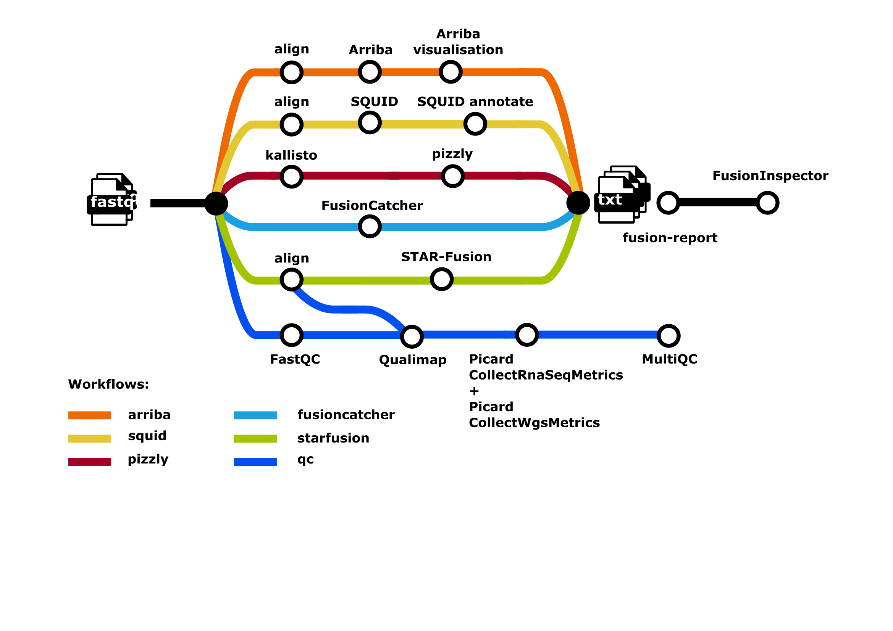

<h1>
  <picture>
    <source media="(prefers-color-scheme: dark)" srcset="docs/images/nf-core-rnafusion_logo_dark_new.png">
    
  </picture>
</h1>

[](https://github.com/nf-core/rnafusion/actions/workflows/nf-test.yml)
[](https://github.com/nf-core/rnafusion/actions/workflows/linting.yml)[](https://nf-co.re/rnafusion/results)[](https://doi.org/10.5281/zenodo.XXXXXXX)
[](https://www.nf-test.com)

[](https://www.nextflow.io/)
[](https://github.com/nf-core/tools/releases/tag/3.3.2)
[](https://docs.conda.io/en/latest/)
[](https://www.docker.com/)
[](https://sylabs.io/docs/)
[](https://cloud.seqera.io/launch?pipeline=https://github.com/nf-core/rnafusion)

[](https://nfcore.slack.com/channels/rnafusion)[](https://bsky.app/profile/nf-co.re)[](https://mstdn.science/@nf_core)[](https://www.youtube.com/c/nf-core)

## Introduction

**nf-core/rnafusion** is a bioinformatics best-practice analysis pipeline for RNA sequencing consisting of several tools designed for detecting and visualizing fusion genes. Results from up to 3 fusion callers tools are created, and are also aggregated, most notably in a pdf visualisation document, a vcf data collection file, and html and tsv reports.

On release, automated continuous integration tests run the pipeline on a full-sized dataset on the AWS cloud infrastructure. This ensures that the pipeline runs on AWS, has sensible resource allocation defaults set to run on real-world datasets, and permits the persistent storage of results to benchmark between pipeline releases and other analysis sources. The results obtained from the full-sized test can be viewed on the [nf-core website](https://nf-co.re/rnafusion/results).

In rnafusion the full-sized test includes reference building and fusion detection. The test dataset is taken from [here](https://github.com/nf-core/test-datasets/tree/rnafusion/testdata/human).

## Pipeline summary



### References

The references for the pipeline can be downloaded from the nf-core AWS megatests S3 bucket using the following command for the [AWS CLI tool](https://github.com/aws/aws-cli):

```bash
aws --no-sign-request s3 sync s3://nf-core-awsmegatests/rnafusion/references/ <path_to_references>
```

The path to the downloaded references can then be provided to the pipeline with the `--genomes_base` parameter.

⚠️ **Please note that the references are large and can take a long time to download, so it is recommended to download them once and use them for all future runs of the pipeline.**

The pipeline is also able to build the references in case files from a specific gencode version are missing (Note: only gencode 46 is available for fusioncatcher). This is done automatically when the expected references are not found and these files will be automatically published in the directory specified by the `--genomes_base` parameter. Use the `--references_only` parameter to trigger the reference building workflow only, without running the rest of the pipeline.

1. Download gencode fasta and gtf files
2. Download the HGNC nomenclature file
3. Create files needed for QC (Sequence Dictionary and RRNA intervals)
4. Convert the gtf file to a refflat file
5. Create the [Salmon](https://salmon.readthedocs.io/en/latest/) index
6. Create [STAR](https://github.com/alexdobin/STAR) index
7. Build [STAR-Fusion](https://github.com/STAR-Fusion/STAR-Fusion) and [CTAT-SPLICING](https://github.com/TrinityCTAT/CTAT-SPLICING) references
8. Download [Fusion-report](https://github.com/Clinical-Genomics/fusion-report) DBs

> [!WARNING]
> References for Fusioncatcher and Arriba cannot be automatically created by the pipeline and should be downloaded from the S3 bucket or another source. See the [References](#references) section for more information.

#### Main workflow

1. Input samplesheet check
2. Reads quality control ([FastQC](https://www.bioinformatics.babraham.ac.uk/projects/fastqc/))
3. Optional trimming with [fastp](https://github.com/OpenGene/fastp)
4. Align FASTQs to BAM with [STAR](https://github.com/alexdobin/STAR)
5. Run fusion detection with [Arriba](https://github.com/suhrig/arriba)
6. Run fusion detection with [STAR-Fusion](https://github.com/STAR-Fusion/STAR-Fusion)
   7a. Optional trimming of 3' end with [fastp](https://github.com/OpenGene/fastp) to feed into fusioncatcher (other tools not affected)
   7b. Run fusion detection with [FusionCatcher](https://github.com/ndaniel/fusioncatcher)
7. Run transcript assembly and quantification with [StringTie](https://ccb.jhu.edu/software/stringtie/)
8. Run cancer splicing aberrations detection with [CTAT-SPLICING](https://github.com/TrinityCTAT/CTAT-SPLICING)
9. Merge all fusions detected by the selected tools with [Fusion-report](https://github.com/Clinical-Genomics/fusion-report)
10. Post-processing and analysis of data
    - [FusionInspector](https://github.com/FusionInspector/FusionInspector)
    - Summarize information into a VCF file
    - [Arriba](https://github.com/suhrig/arriba) visualisation
    - Collect metrics ([`picard CollectRnaSeqMetrics`](https://gatk.broadinstitute.org/hc/en-us/articles/360037057492-CollectRnaSeqMetrics-Picard-)), [`picard CollectInsertSizeMetrics`](https://gatk.broadinstitute.org/hc/en-us/articles/360037055772-CollectInsertSizeMetrics-Picard-) and ([`GATK MarkDuplicates`](https://gatk.broadinstitute.org/hc/en-us/articles/360037052812-MarkDuplicates-Picard-))
11. Present QC for raw reads ([`MultiQC`](http://multiqc.info/))
12. Compress bam files to cram with [samtools view](http://www.htslib.org/)

## Usage

> [!NOTE]
> If you are new to Nextflow and nf-core, please refer to [this page](https://nf-co.re/docs/usage/installation) on how to set-up Nextflow. Make sure to [test your setup](https://nf-co.re/docs/usage/introduction#how-to-run-a-pipeline) with `-profile test` before running the workflow on actual data.

As the reference building is computationally heavy (> 24h on HPC), we had to use dummy reference files in the test profile. Therefore, it is recommended to run the test profile with the `-stub` option.

```bash
nextflow run nf-core/rnafusion \
   -profile test,<docker/singularity/.../institute> \
   --outdir <OUTDIR> \
   -stub
```

> [!WARNING]
> Please provide pipeline parameters via the CLI or Nextflow `-params-file` option. Custom config files including those provided by the `-c` Nextflow option can be used to provide any configuration _**except for parameters**_; see [docs](https://nf-co.re/docs/usage/getting_started/configuration#custom-configuration-files).

> **Notes:**
>
> - Conda is not currently supported; run with singularity or docker.
> - Paths need to be absolute.
> - GRCh38 is the only supported reference.
> - Single-end reads are to be used as last-resort. Paired-end reads are recommended. FusionCatcher cannot be used with single-end reads shorter than 130 bp.

For more details and further functionality, please refer to the [usage documentation](https://nf-co.re/rnafusion/usage) and the [parameter documentation](https://nf-co.re/rnafusion/parameters).

## Pipeline output

To see the results of an example test run with a full size dataset refer to the [results](https://nf-co.re/rnafusion/results) tab on the nf-core website pipeline page.
For more details about the output files and reports, please refer to the
[output documentation](https://nf-co.re/rnafusion/output).

## Credits

nf-core/rnafusion was written by Martin Proks ([@matq007](https://github.com/matq007)), Maxime Garcia ([@maxulysse](https://github.com/maxulysse)) and Annick Renevey ([@rannick](https://github.com/rannick))

## We thank the following people for their help in the development of this pipeline

- [Phil Ewels](https://github.com/ewels)
- [Rickard Hammarén](https://github.com/Hammarn)
- [Alexander Peltzer](https://github.com/apeltzer)
- [Praveen Raj](https://github.com/praveenraj2018)

## Contributions and Support

If you would like to contribute to this pipeline, please see the [contributing guidelines](.github/CONTRIBUTING.md).

For further information or help, don't hesitate to get in touch on the [Slack `#rnafusion` channel](https://nfcore.slack.com/channels/rnafusion) (you can join with [this invite](https://nf-co.re/join/slack)).

## Citations

If you use nf-core/rnafusion for your analysis, please cite it using the following doi: [10.5281/zenodo.3946477](https://doi.org/10.5281/zenodo.3946477)

An extensive list of references for the tools used by the pipeline can be found in the [`CITATIONS.md`](CITATIONS.md) file.

You can cite the `nf-core` publication as follows:

> **The nf-core framework for community-curated bioinformatics pipelines.**
>
> Philip Ewels, Alexander Peltzer, Sven Fillinger, Harshil Patel, Johannes Alneberg, Andreas Wilm, Maxime Ulysse Garcia, Paolo Di Tommaso & Sven Nahnsen.
>
> _Nat Biotechnol._ 2020 Feb 13. doi: [10.1038/s41587-020-0439-x](https://dx.doi.org/10.1038/s41587-020-0439-x).
