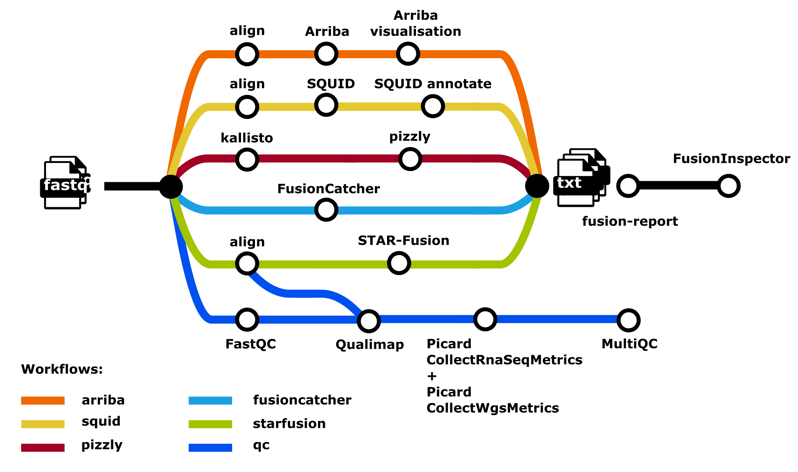

<h1>
  <picture>
    <source media="(prefers-color-scheme: dark)" srcset="docs/images/nf-core-rnafusion_logo_dark.png">
    
  </picture>
</h1>

[](https://github.com/nf-core/rnafusion/actions/workflows/ci.yml)
[](https://github.com/nf-core/rnafusion/actions/workflows/linting.yml)[](https://nf-co.re/rnafusion/results)[](https://doi.org/10.5281/zenodo.2565517)
[](https://www.nf-test.com)

[](https://www.nextflow.io/)
[](https://docs.conda.io/en/latest/)
[](https://www.docker.com/)
[](https://sylabs.io/docs/)
[](https://cloud.seqera.io/launch?pipeline=https://github.com/nf-core/rnafusion)

[](https://nfcore.slack.com/channels/rnafusion)[](https://twitter.com/nf_core)[](https://mstdn.science/@nf_core)[](https://www.youtube.com/c/nf-core)

## Introduction

**nf-core/rnafusion** is a bioinformatics best-practice analysis pipeline for RNA sequencing consisting of several tools designed for detecting and visualizing fusion genes. Results from up to 5 fusion callers tools are created, and are also aggregated, most notably in a pdf visualiation document, a vcf data collection file, and html and tsv reports.

On release, automated continuous integration tests run the pipeline on a full-sized dataset on the AWS cloud infrastructure. This ensures that the pipeline runs on AWS, has sensible resource allocation defaults set to run on real-world datasets, and permits the persistent storage of results to benchmark between pipeline releases and other analysis sources. The results obtained from the full-sized test can be viewed on the [nf-core website](https://nf-co.re/rnafusion/results).

In rnafusion the full-sized test includes reference building and fusion detection. The test dataset is taken from [here](https://github.com/nf-core/test-datasets/tree/rnafusion/testdata/human).

## Pipeline summary



### Build references

`--build_references` triggers a parallel workflow to build references, which is a prerequisite to running the pipeline:

1. Download ensembl fasta and gtf files
2. Create [STAR](https://github.com/alexdobin/STAR) index
3. Download [Arriba](https://github.com/suhrig/arriba) references
4. Download [FusionCatcher](https://github.com/ndaniel/fusioncatcher) references
5. Download and build [STAR-Fusion](https://github.com/STAR-Fusion/STAR-Fusion) references
6. Download [Fusion-report](https://github.com/Clinical-Genomics/fusion-report) DBs

#### Main workflow

1. Input samplesheet check
2. Concatenate fastq files per sample ([cat](http://www.linfo.org/cat.html))
3. Reads quality control ([FastQC](https://www.bioinformatics.babraham.ac.uk/projects/fastqc/))
4. Optional trimming with [fastp](https://github.com/OpenGene/fastp)
5. Arriba subworkflow
   - [STAR](https://github.com/alexdobin/STAR) alignment
   - [Arriba](https://github.com/suhrig/arriba) fusion detection
6. STAR-fusion subworkflow
   - [STAR](https://github.com/alexdobin/STAR) alignment
   - [STAR-Fusion](https://github.com/STAR-Fusion/STAR-Fusion) fusion detection
7. Fusioncatcher subworkflow
   - [FusionCatcher](https://github.com/ndaniel/fusioncatcher) fusion detection
8. StringTie subworkflow
   - [StringTie](https://ccb.jhu.edu/software/stringtie/)
9. Fusion-report
   - Merge all fusions detected by the selected tools with [Fusion-report](https://github.com/Clinical-Genomics/fusion-report)
10. Post-processing and analysis of data
    - [FusionInspector](https://github.com/FusionInspector/FusionInspector)
    - [Arriba](https://github.com/suhrig/arriba) visualisation
    - Collect metrics ([`picard CollectRnaSeqMetrics`](https://gatk.broadinstitute.org/hc/en-us/articles/360037057492-CollectRnaSeqMetrics-Picard-), [`picard CollectInsertSizeMetrics`](https://gatk.broadinstitute.org/hc/en-us/articles/360037055772-CollectInsertSizeMetrics-Picard-) and ([`picard MarkDuplicates`](https://gatk.broadinstitute.org/hc/en-us/articles/360037052812-MarkDuplicates-Picard-))
11. Present QC for raw reads ([`MultiQC`](http://multiqc.info/))
12. Compress bam files to cram with [samtools view](http://www.htslib.org/)

## Usage

> [!NOTE]
> If you are new to Nextflow and nf-core, please refer to [this page](https://nf-co.re/docs/usage/installation) on how to set-up Nextflow. Make sure to [test your setup](https://nf-co.re/docs/usage/introduction#how-to-run-a-pipeline) with `-profile test` before running the workflow on actual data.

As the reference building is computationally heavy (> 24h on HPC), it is recommended to test the pipeline with the `-stub` parameter (creation of empty files):

First, build the references:

```bash
nextflow run nf-core/rnafusion \
   -profile test,<docker/singularity/.../institute> \
   --outdir <OUTDIR>\
   --build_references \
   -stub
```

Then perform the analysis:

```bash
nextflow run nf-core/rnafusion \
   -profile test,<docker/singularity/.../institute> \
   --outdir <OUTDIR>\
   -stub
```

> [!WARNING]
> Please provide pipeline parameters via the CLI or Nextflow `-params-file` option. Custom config files including those provided by the `-c` Nextflow option can be used to provide any configuration _**except for parameters**_; see [docs](https://nf-co.re/docs/usage/getting_started/configuration#custom-configuration-files).

> **Notes:**
>
> - Conda is not currently supported; run with singularity or docker.
> - Paths need to be absolute.
> - GRCh38 is the only supported reference.
> - Single-end reads are to be used as last-resort. Paired-end reads are recommended. FusionCatcher cannot be used with single-end reads shorter than 130 bp.

For more details and further functionality, please refer to the [usage documentation](https://nf-co.re/rnafusion/usage) and the [parameter documentation](https://nf-co.re/rnafusion/parameters).

## Pipeline output

To see the results of an example test run with a full size dataset refer to the [results](https://nf-co.re/rnafusion/results) tab on the nf-core website pipeline page.
For more details about the output files and reports, please refer to the
[output documentation](https://nf-co.re/rnafusion/output).

## Credits

nf-core/rnafusion was written by Martin Proks ([@matq007](https://github.com/matq007)), Maxime Garcia ([@maxulysse](https://github.com/maxulysse)) and Annick Renevey ([@rannick](https://github.com/rannick))

We thank the following people for their help in the development of this pipeline:

- [Phil Ewels](https://github.com/ewels)
- [Rickard Hammarén](https://github.com/Hammarn)
- [Alexander Peltzer](https://github.com/apeltzer)
- [Praveen Raj](https://github.com/praveenraj2018)

## Contributions and Support

If you would like to contribute to this pipeline, please see the [contributing guidelines](.github/CONTRIBUTING.md).

For further information or help, don't hesitate to get in touch on the [Slack `#rnafusion` channel](https://nfcore.slack.com/channels/rnafusion) (you can join with [this invite](https://nf-co.re/join/slack)).

## Citations

If you use nf-core/rnafusion for your analysis, please cite it using the following doi: [10.5281/zenodo.3946477](https://doi.org/10.5281/zenodo.3946477)

An extensive list of references for the tools used by the pipeline can be found in the [`CITATIONS.md`](CITATIONS.md) file.

You can cite the `nf-core` publication as follows:

> **The nf-core framework for community-curated bioinformatics pipelines.**
>
> Philip Ewels, Alexander Peltzer, Sven Fillinger, Harshil Patel, Johannes Alneberg, Andreas Wilm, Maxime Ulysse Garcia, Paolo Di Tommaso & Sven Nahnsen.
>
> _Nat Biotechnol._ 2020 Feb 13. doi: [10.1038/s41587-020-0439-x](https://dx.doi.org/10.1038/s41587-020-0439-x).
