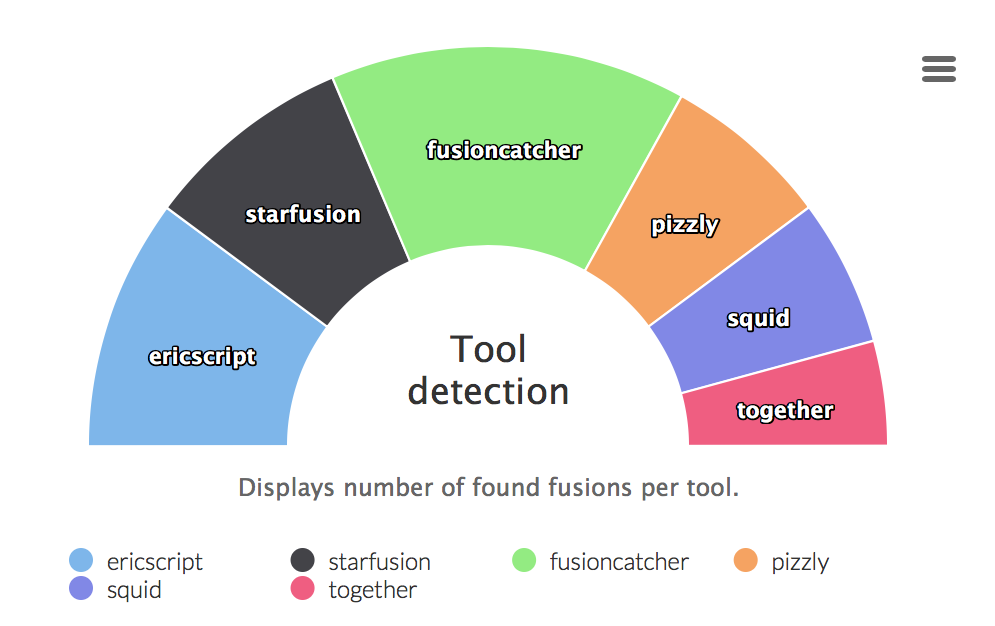
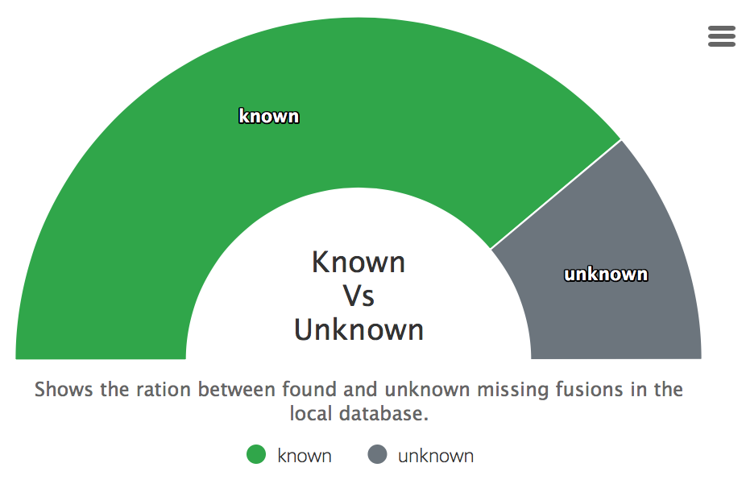
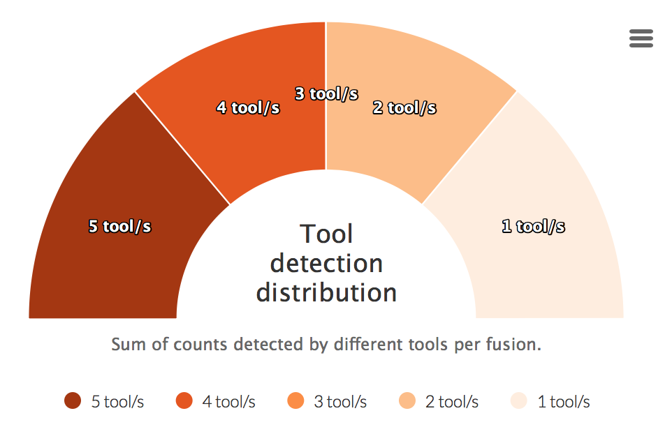

# nf-core/rnafusion: Output

This document describes the output produced by the pipeline.

## Pipeline overview

The pipeline is built using [Nextflow](https://www.nextflow.io/)
and processes data using the following steps:

* [Arriba](#arriba)
* [EricScript](#ericscript)
* [FastQC](#fastqc) - read quality control
* [FusionCatcher](#fusioncatcher)
* [FusionInspector](#fusion-inspector)
* [fusion-report](#fusion-report)
* [MultiQC](#multiqc) - aggregate report, describing results of the whole pipeline
* [Pizzly](#pizzly)
* [Squid](#squid)
* [Star-Fusion](#star-fusion)

## Arriba

**Output directory: `results/tools/Arriba`**

* `fusions.tsv`
  * contains fusions which pass all of Arriba's filters. It should be highly enriched for true predictions. The predictions are listed from highest to lowest confidence.
* `fusions.discarded.tsv`
  * contains all events that Arriba classified as an artifact or that are also observed in healthy tissue. This file may be useful, if one suspects that an event should be present, but was erroneously discarded by Arriba.
* `<sample>.pdf`
  * contains fusion visualization when opted for `--arriba_vis`

## EricScript

**Output directory: `results/tools/Ericscript/tmp`**

* `fusions.results.filtered.tsv`
  * contains all the predicted gene fusions

|  Column | Description |
| ------- | ----------- |
| GeneName1 | official gene name of 5' gene. |
| GeneName2 | official gene name of 3' gene. |
| chr1 | chromosome of 5' gene. |
| Breakpoint1 | predicted breakpoint on 5' gene. |
| strand1 | strand (-/+) of 5' gene. |
| chr2 | chromosome of 3' gene. |
| Breakpoint2 | predicted breakpoint on 3' gene. |
| strand2 | strand (-/+) of 3' gene. |
| EnsemblGene1 | Ensembl gene ID of 5' gene. |
| EnsemblGene2 | Ensembl gene ID of 3' gene. |
| crossingreads | the number of paired end discordant reads. |
| spanningreads | the number of paired end reads spanning the junction. |
| mean.insertsize | mean of insert sizes of crossing + spanning reads. |
| homology | if filled, all the homologies between the fusion junction and Ensembl genes. |
| fusiontype | intra-chromosomal, inter-chromosomal, read-through or CIS. |
| InfoGene1 | gene information about 5' gene. |
| InfoGene2 | gene information about 3' gene. |
| JunctionSequence | predicted junction fusion sequence. |
| GeneExpr1 | Read count based estimation of the expression level of 5' gene. |
| GeneExpr2 | Read count based estimation of the expression level of 3' gene. |
| GeneExpr_fused | Read count based estimation of the expression level of the predicted chimeric transcript. |
| ES | Edge score. |
| GJS | Genuine Junction score. |
| US | Uniformity score. |
| EricScore | EricScore score (adaboost classifier). |

For more info check the [documentation](https://sites.google.com/site/bioericscript/getting-started).

## FastQC

[FastQC](http://www.bioinformatics.babraham.ac.uk/projects/fastqc/) gives general quality metrics about your reads. It provides information about the quality score distribution across your reads, the per base sequence content (%T/A/G/C). You get information about adapter contamination and other overrepresented sequences.

For further reading and documentation see the [FastQC help](http://www.bioinformatics.babraham.ac.uk/projects/fastqc/Help/).

> **NB:** The FastQC plots displayed in the MultiQC report shows _untrimmed_ reads. They may contain adapter sequence and potentially regions with low quality. To see how your reads look after trimming, look at the FastQC reports in the `trim_galore` directory.

**Output directory: `results/fastqc`**

* `sample_fastqc.html`
  * FastQC report, containing quality metrics for your untrimmed raw fastq files
* `zips/sample_fastqc.zip`
  * zip file containing the FastQC report, tab-delimited data file and plot images

## Fusioncatcher

**Output directory: `results/tools/Fusioncatcher`**

* `final-list_candidate-fusion-genes.txt`
  * contains all the predicted gene fusions

|  Column | Description |
| ------- | ----------- |
| **Gene\_1\_symbol(5end\_fusion\_partner)** | Gene symbol of the 5' end fusion partner |
| **Gene\_2\_symbol\_2(3end\_fusion\_partner)** | Gene symbol of the 3' end fusion partner |
| **Gene\_1\_id(5end\_fusion\_partner)** | Ensembl gene id of the 5' end fusion partner |
| **Gene\_2\_id(3end\_fusion\_partner)** | Ensembl gene id of the 3' end fusion partner |
| **Exon\_1\_id(5end\_fusion\_partner)** | Ensembl exon id of the 5' end fusion exon-exon junction |
| **Exon\_2\_id(3end\_fusion\_partner)** | Ensembl exon id of the 3' end fusion exon-exon junction |
| **Fusion\_point\_for\_gene\_1(5end\_fusion\_partner)** | Chromosomal position of the 5' end of fusion junction (chromosome:position:strand); 1-based coordinate |
| **Fusion\_point\_for\_gene\_2(3end\_fusion\_partner)** | Chromosomal position of the 3' end of fusion junction (chromosome:position:strand); 1-based coordinate |
| **Spanning\_pairs** | Count of pairs of reads supporting the fusion (**including** also the multimapping reads) |
| **Spanning\_unique\_reads** | Count of unique reads (i.e. unique mapping positions) mapping on the fusion junction. Shortly, here are counted all the reads which map on fusion junction minus the PCR duplicated reads. |
| **Longest\_anchor\_found** | Longest anchor (hangover) found among the unique reads mapping on the fusion junction |
| **Fusion\_finding\_method** | Aligning method used for mapping the reads and finding the fusion genes. Here are two methods used which are: (i) **BOWTIE** = only Bowtie aligner is used for mapping the reads on the genome and exon-exon fusion junctions, (ii) **BOWTIE+BLAT** = Bowtie aligner is used for mapping reads on the genome and BLAT is used for mapping reads for finding the fusion junction,  (iii) **BOWTIE+STAR** = Bowtie aligner is used for mapping reads on the genome and STAR is used for mapping reads for finding the fusion junction, (iv) **BOWTIE+BOWTIE2** = Bowtie aligner is used for mapping reads on the genome and Bowtie2 is used for mapping reads for finding the fusion junction. |
| **Fusion\_sequence** | The inferred fusion junction (the asterisk sign marks the junction point) |
| **Fusion\_description** | Type of the fusion gene (see the Table 2) |
| **Counts\_of\_common\_mapping\_reads** | Count of reads mapping simultaneously on both genes which form the fusion gene. This is an indication how similar are the DNA/RNA sequences of the genes forming the fusion gene (i.e. what is their homology because highly homologous genes tend to appear show as candidate fusion genes). In case of completely different sequences of the genes involved in forming a fusion gene then here it is expected to have the value zero. |
| **Predicted\_effect** | Predicted effect of the candidate fusion gene using the annotation from Ensembl database. This is shown in format **effect\_gene\_1**/**effect\_gene\_2**, where the possible values for effect\_gene\_1 or effect\_gene\_2 are: **intergenic**, **intronic**, **exonic(no-known-CDS)**, **UTR**, **CDS(not-reliable-start-or-end)**, **CDS(truncated)**, or **CDS(complete)**. In case that the fusion junction for both genes is within their CDS (coding sequence) then only the values **in-frame** or **out-of-frame** will be shown. |
| **Predicted\_fused\_transcripts** | All possible known fused transcripts in format ENSEMBL-TRANSCRIPT-1:POSITION-1/ENSEMBLE-TRANSCRIPT-B:POSITION-2, where are fused the sequence 1:POSITION-1 of transcript ENSEMBL-TRANSCRIPT-1 with sequence POSITION-2:END of transcript ENSEMBL-TRANSCRIPT-2 |
| **Predicted\_fused\_proteins** | Predicted amino acid sequences of all possible fused proteins (separated by ";").  |

For more info check the [documentation](https://github.com/ndaniel/fusioncatcher/blob/master/doc/manual.md#62---output-data-output-data).

## Fusion Inspector

**Output directory: `results/tools/FusionInspector`**

* `finspector.fa`
  * the candidate fusion-gene contigs (if you copy things elsewhere, make sure to also copy the index file: `finspector.fa.fai`)
* `finspector.bed`
  * the reference gene structure annotations for fusion partners
* `finspector.junction_reads.bam`
  * alignments of the breakpoint-junction supporting reads.
* `finspector.spanning_reads.bam`
  * alignments of the breakpoint-spanning paired-end reads.

To visualize fusion genes in [IGV tool](https://software.broadinstitute.org/software/igv/igvtools) first create a genome `Menu->Genomes->Create .genome File`, choose name and description, then choose the following files:

* `finspector.fa`
  * make sure the index file finspector.fa.fai is in the same folder
* `finspector.gtf`
  * use this for 'Genes'
* `cytoBand.txt`
  * use this for 'optional Cytoband'

Add the bam files by choosing `File->Load from File` and make sure to select your generated mini genome in the upper-left corner.
For more info and help check [wiki page](https://github.com/FusionInspector/FusionInspector/wiki).

## fusion-report

**Output directory: `results/Report-<READS_BASE_NAME>`**

* `fusions.json`
  * contains all main information about found fusions (fusion name, score, explanation of the score calculation, cherry picked output from fusion tools)
* `index.html`
  * main dashboard containing the list of all detected fusions
* `*.html`
  * each fusion gets a custom page with fetched data from the local database
* `fusions_list_filtered.txt`
  * filtered list of found fusions (uses tool cutoff as filter, by default: 2, can be adjusted by adding `-t <num>` when running the tool)
* `fusions_list.txt`
  * unfiltered list of found fusions
  
### Tool detection

Graphs displaying ratio of fusion genes caught by different tools. The last part *all tools* is an intersection of all tools.

### Found in database

Displays how many fusions were found in a downloaded databases of the summary report.

### Tool detection distribution

For each fusion a sum of detected tools is calculated. This counts are then visualized in the graph below.

## MultiQC

[MultiQC](http://multiqc.info) is a visualisation tool that generates a single HTML report summarising all samples in your project. Most of the pipeline QC results are visualised in the report and further statistics are available in within the report data directory.

The pipeline has special steps which allow the software versions used to be reported in the MultiQC output for future traceability.

**Output directory: `results/multiqc`**

* `Project_multiqc_report.html`
  * MultiQC report - a standalone HTML file that can be viewed in your web browser
* `Project_multiqc_data/`
  * Directory containing parsed statistics from the different tools used in the pipeline

For more information about how to use MultiQC reports, see [http://multiqc.info](http://multiqc.info)

## Pizzly

**Output directory: `results/tools/Pizzly`**

* `pizzly_fusions.json`
  * contains all the predicted gene fusions

|  Column | Description |
| ------- | ----------- |
| geneA | `id`: reference id and `name`: gene name |
| geneB | Describes reference id and gene name |
| paircount | Number of paired count |
| splitcount | Number of split count |
| transcripts | List of all transcripts `fasta_record`, `transcriptA`, `transcriptB`, `support`, `reads` |
| readpairs | List of read pairs containing (`type`, `read1`, `read2`) |

For more info check the [documentation](https://github.com/pmelsted/pizzly#output).

## Squid

**Output directory: `results/tools/Squid`**

* `fusions_annotated.txt`
  * contains all the predicted gene fusions

|  Column | Description |
| ------- | ----------- |
| chr1 | chromosome name of the first breakpoint.
| start1 | starting position of the segment of the first breakpoint, or the predicted breakpoint position if strand1 is "-" |
| end1 | ending position of the segment of the first breakpoint, or the predicted breakpoint position if strand1 is "+" |
| chr2 | chromosome name of the second breakpoint |
| start2 | starting position of the segment of the second breakpoint, or the predicted breakpoint position if strand2 is "-" |
| end2 | ending position of the segment of the second breakpoint, or the predicted breakpoint position if strand2 is "+" |
| name | TSV is not named yet, this column shows with dot.
| score | number of reads supporting this TSV (without weighted by Discordant edge ratio multiplier) |
| strand1 | strand of the first segment in TSV.
| strand2 | strand of the second segment in TSV.
| num_concordantfrag_bp1 | number of concordant paired-end reads covering the first breakpoint. For a concordant paired-end read, it includes two ends and a inserted region in between, if any of the 3 regions covers the breakpoint, the read is counted in this number |
| num_concordantfrag_bp2 | number of concordant paired-end reads covering the second breakpoint. The count is defined in the same way as num_concordantfrag_bp1 |

For more info check the [documentation](https://github.com/Kingsford-Group/squid#output-specification).

## Star-Fusion

**Output directory: `results/tools/StarFusion`**

* `star-fusion.fusion_predictions.tsv`
  * contains all the predicted gene fusions

|  Column | Description |
| ------- | ----------- |
| JunctionReadCount | Indicates the number of RNA-Seq fragments containing a read that aligns as a split read at the site of the putative fusion junction. |
| SpanningFragCount | Indicates the number of RNA-Seq fragments that encompass the fusion junction such that one read of the pair aligns to a different gene than the other paired-end read of that fragment. |
| SpliceType | Indicates whether the proposed breakpoint occurs at reference exon junctions as provided by the reference transcript structure annotations (ex. gencode).
| LeftGene
| LeftBreakpoint
| RightGene
| RightBreakpoint
| LargeAnchorSupport | column indicates whether there are split reads that provide 'long' (set to length of 25 bases) alignments on both sides of the putative breakpoint. |
| FFPM | fusion fragments per million total reads; **Default:** *0.1 (meaning at least 1 fusion-supporting rna-seq fragment per 10M total reads)*; **TL;DR:** can be adjusted by changing `--min_FFPM`
| LeftBreakDinuc |  |
| LeftBreakEntropy | Represents Shannon entropy |
| RightBreakDinuc |
| RightBreakEntropy | Represents Shannon entropy |
| annots | Annotation generated by [FusionAnnotar](https://github.com/FusionAnnotator/FusionAnnotator/wiki) |

For more info check the [documentation](https://github.com/STAR-Fusion/STAR-Fusion/wiki#Outputs).
